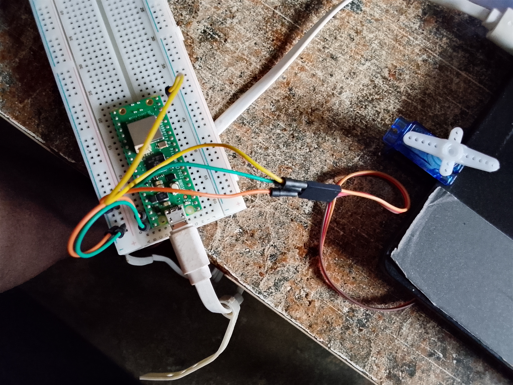

# Servo Angle Control using Raspberry Pi Pico W

## Overview

The **Servo Angle Control System** is a MicroPython-based embedded systems project developed for the **Raspberry Pi Pico W**. The project demonstrates precise position control of a servo motor through user-defined angle inputs entered via the Thonny Shell.

The application generates a **Pulse Width Modulation (PWM)** signal on the Pico W and converts the user's desired angle into the corresponding PWM duty cycle required by a standard hobby servo. This provides an interactive and practical introduction to PWM-based motor control, user input processing, and embedded programming with MicroPython.

---

# Project Objectives

This project was developed to demonstrate the following embedded systems concepts:

* Servo motor control using PWM
* Interactive user input through the Thonny Shell
* Angle-to-duty-cycle conversion
* GPIO programming with MicroPython
* Raspberry Pi Pico W peripheral control
* Real-time actuator positioning

---

# Key Features

* Interactive servo angle control
* User-defined positioning between 0° and 180°
* PWM-based motor control
* Real-time command processing
* Simple angle calibration algorithm
* Beginner-friendly MicroPython project
* Raspberry Pi Pico W implementation

---

# Hardware Components

* Raspberry Pi Pico W
* Standard Servo Motor
* Jumper Wires
* USB Cable

---

# Hardware Connections

| Servo Pin | Raspberry Pi Pico W Connection |
| --------- | ------------------------------ |
| VCC       | 5V (VBUS)                      |
| GND       | GND                            |
| Signal    | GP15                           |

---

# System Operation

## 1. PWM Signal Generation

The Raspberry Pi Pico W initializes a PWM signal on **GPIO 15** with a frequency of **50 Hz**, which is the standard operating frequency for most hobby servo motors.

This PWM signal provides the timing information required to control the angular position of the servo.

---

## 2. User Input

The program continuously prompts the user to enter a desired servo angle through the Thonny Shell.

Valid input values range from:

**0° to 180°**

Each entered value represents the target position for the servo motor.

---

## 3. Angle Conversion

After receiving the user's input, the program converts the desired angle into the appropriate 16-bit PWM duty cycle value.

The conversion is performed using the following equation:

```python
writeval = ((6553 / 180) * angle) + 1638
```

This formula maps the angular position to the pulse width expected by the servo, ensuring accurate and repeatable positioning.

---

## 4. Servo Positioning

The calculated PWM duty cycle is applied to the servo using the `duty_u16()` function.

The servo immediately rotates to the requested position, after which the program waits briefly before accepting another user command.

This process repeats continuously, allowing real-time interactive control.

---

# Example Output

```text
what angle do you desire? 45
Servo moves to 45°

what angle do you desire? 90
Servo moves to 90°

what angle do you desire? 180
Servo moves to 180°
```

---

# Source Code

The complete MicroPython source [code](code) for this project is included in this repository.

The implementation demonstrates:

* PWM initialization
* GPIO configuration
* User input handling
* Angle-to-duty-cycle conversion
* Servo position control

---

# Demonstration



The demonstration showcases:

* Interactive angle input
* Smooth servo positioning
* PWM signal control
* Real-time response to user commands

---

# Learning Outcomes

This project strengthened practical knowledge in several core embedded systems concepts, including:

* Pulse Width Modulation (PWM)
* Servo motor operation
* Raspberry Pi Pico W programming
* MicroPython development
* GPIO peripheral control
* Interactive embedded applications
* Real-time actuator control
* Embedded hardware and software integration

---

# Challenges Encountered

During development, several practical challenges were addressed, including:

* Determining the correct PWM frequency for reliable servo operation
* Calculating an accurate angle-to-duty-cycle conversion
* Ensuring smooth and consistent servo positioning
* Managing user input within an interactive embedded application

Addressing these challenges provided valuable experience in motor control and actuator interfacing using MicroPython.

---

# Technical Highlights

* Raspberry Pi Pico W Programming
* MicroPython
* Pulse Width Modulation (PWM)
* Servo Motor Control
* GPIO Programming
* User Input Processing
* Embedded Systems Development
* Real-Time Actuator Control
* Hardware and Software Integration

---

# Potential Applications

The techniques demonstrated in this project can be extended to a variety of embedded and robotics applications, including:

* Robotic arm control
* Pan-and-tilt camera systems
* Automated door mechanisms
* Smart home actuators
* CNC positioning systems
* Educational robotics
* Autonomous vehicle steering
* Precision mechanical positioning

---

# Future Enhancements

Potential improvements for future versions include:

* Servo control using a potentiometer
* Joystick-based positioning
* OLED display for angle visualization
* Wi-Fi remote control using the Pico W
* Web-based servo control interface
* Bluetooth connectivity
* Preset position memory
* Multi-servo synchronization
* Smooth motion interpolation between positions

---

# Project Status

**Completed**

This project successfully demonstrates interactive servo motor control using the Raspberry Pi Pico W and MicroPython. By combining PWM signal generation, user input processing, and precise actuator control, it provides a practical foundation for more advanced robotics, automation, and embedded motion-control applications.

---

# Author

**Muhammad Musa**

**Computer Engineering Student | Embedded Systems | Raspberry Pi Pico W | Robotics | MicroPython**

Passionate about designing intelligent embedded systems that combine precise hardware control, efficient software design, and real-time interaction to solve practical engineering challenges.
